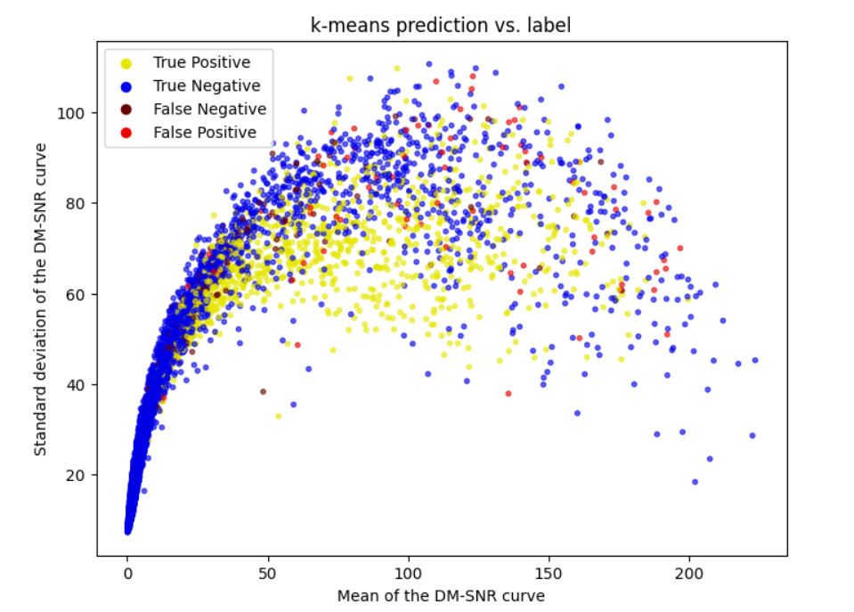
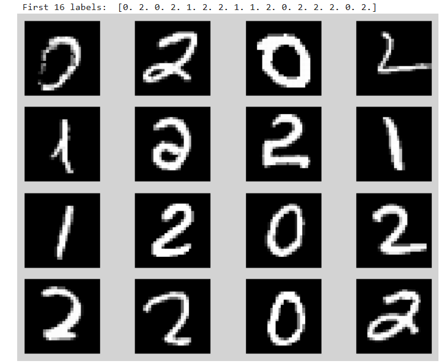
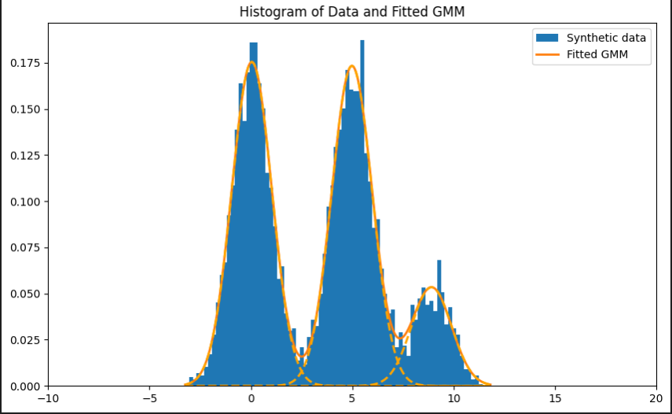

# Machine Learning Tools

A comprehensive collection of machine learning tools and algorithms implemented across various techniques and models. This repository serves as a toolkit for exploring, learning, and implementing foundational ML concepts.

<p align="center">
  
  
  
</p>
## Repository Contents

- **Gaussian MatLab**: Gaussian-related models and implementations in MATLAB.
- **Gradient Descent**: Optimization algorithms for gradient-based learning.
- **Kernels**: Tools for working with kernel methods, including SVM and other kernel-based models.
- **Logistic Regression LASSO**: Logistic regression models with LASSO regularization.
- **Principal Component Analysis**: Implementation of PCA for dimensionality reduction.
- **Regression**: General regression models and techniques.
- **SDL MNIST Dataset**: Tools and datasets related to MNIST.
- **Statistical Inference**: Statistical methods and inference techniques.
- **Transformers**: Transformer-based models for NLP and other tasks.
- **k-means Clustering**: K-means clustering with applications to pulsar data.

## Getting Started

Clone the repository:

```bash
git clone https://github.com/davidomanovic/machine-learning-tools.git
cd ml-toolbox
